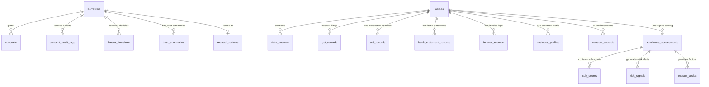

# TrustBridge AI: Database Schema Documentation

TrustBridge AI utilizes a relational SQL database structure, compatible with **PostgreSQL** (production) and **SQLite** (development/testing). The database maps core business definitions to underwriting and audit structures.

---

## 1. Operational Underwriting Tables (Muskan's Models)

These tables support borrower registration, active consent management, underwriting audits, and manual review routing.

### 1.1 `borrowers`
Stores registered borrower identities.
*   **`id`** (`String`, PK): Unique borrower ID (external UUID or PAN reference).
*   **`name`** (`String`): Full name of the applicant/promoter.
*   **`business_name`** (`String`): Registered legal entity name of the business.
*   **`pan`** (`String`, Unique): Permanent Account Number (PAN) of the business/owner.
*   **`gstin`** (`String`, Unique): Goods and Services Tax Identification Number.
*   **`email`** (`String`, Unique): Business contact email.
*   **`phone`** (`String`, Unique): Mobile phone number.
*   **`created_at`** (`DateTime`): Timestamp of borrower profile creation.

### 1.2 `consents`
Tracks time-bound consents granted by the borrower for alternative data access.
*   **`id`** (`Integer`, PK, Autoincrement): Auto-incrementing identifier.
*   **`borrower_id`** (`String`, FK -> `borrowers.id`): Relates consent to a borrower.
*   **`data_source`** (`String`): Alternating source name (`bank_statements`, `gst`, `upi`, `invoices`, `business_profile`).
*   **`purpose`** (`String`): Stated purpose of usage (e.g. "Cash Flow Stability Assessment").
*   **`scope`** (`String`): Access scope (e.g., `read`).
*   **`expiry`** (`DateTime`): Timestamp when consent automatically expires.
*   **`status`** (`String`): Current consent status (`approved`, `revoked`, `expired`).
*   **`used_for`** (`String`, Nullable): Description of actual usage.
*   **`granted_at`** (`DateTime`): Timestamp when consent was authorized.
*   **`revoked_at`** (`DateTime`, Nullable): Timestamp if manually revoked.

### 1.3 `consent_audit_logs`
An immutable ledger for audit trace compliance.
*   **`id`** (`Integer`, PK, Autoincrement): Primary key.
*   **`borrower_id`** (`String`, FK -> `borrowers.id`): Associated borrower.
*   **`data_source`** (`String`): Targeted alternative data source.
*   **`action`** (`String`): Action taken (`grant`, `revoke`, `use`, `use_denied`, `expire`).
*   **`purpose`** (`String`): Stated purpose for accessing data.
*   **`timestamp`** (`DateTime`): Log entry timestamp.
*   **`details`** (`String`, Nullable): Additional trace context (e.g. API endpoints).

### 1.4 `lender_policies`
Stores policy settings configured by the lenders.
*   **`id`** (`Integer`, PK, Autoincrement): Primary key.
*   **`lender_id`** (`String`, Unique): Unique identifier for the partner lender (e.g., `lender_default`).
*   **`preference`** (`String`): Risk setting (`Conservative`, `Balanced`, `Aggressive`).
*   **`updated_at`** (`DateTime`): Timestamp of last policy adjustment.

### 1.5 `lender_decisions`
Stores permanent audit logs of final underwriter actions.
*   **`id`** (`Integer`, PK, Autoincrement): Primary key.
*   **`borrower_id`** (`String`, FK -> `borrowers.id`): Targeted applicant.
*   **`lender_id`** (`String`): ID of the resolving underwriter.
*   **`decision`** (`String`): Decision type (`approved`, `rejected`, `escalated`).
*   **`notes`** (`String`, Nullable): Explanation notes from the underwriter.
*   **`timestamp`** (`DateTime`): Timestamp when decision was logged.

### 1.6 `manual_reviews`
Supports routing borderline applications to the underwriter review queue.
*   **`id`** (`Integer`, PK, Autoincrement): Primary key.
*   **`borrower_id`** (`String`, FK -> `borrowers.id`, Unique): Active review applicant.
*   **`status`** (`String`): Queue status (`pending`, `resolved`, `escalated`).
*   **`assigned_to`** (`String`, Nullable): Underwriter ID assigned to review the case.
*   **`risk_signals`** (`JSON`): List of active risk flags causing routing.
*   **`anomaly_flags`** (`JSON`): List of compliance anomalies.
*   **`created_at`** (`DateTime`): Timestamp of routing.
*   **`resolved_at`** (`DateTime`, Nullable): Timestamp of manual resolution.
*   **`resolution_notes`** (`String`, Nullable): Underwriter notes describing the resolution.

### 1.7 `trust_summaries`
Persists explainable credit trust summaries containing Gemini AI narratives.
*   **`id`** (`Integer`, PK, Autoincrement): Primary key.
*   **`borrower_id`** (`String`, FK -> `borrowers.id`): Associated borrower.
*   **`readiness_grade`** (`String`): Calculated credit readiness grade (e.g. "A").
*   **`confidence_band`** (`String`): Credit scoring confidence (`High`, `Medium`, `Low`).
*   **`coverage_pct`** (`Float`): Percentage score of alternative data connected.
*   **`risk_signals`** (`JSON`): List of risk strings.
*   **`reason_codes`** (`JSON`): List of rating factor reason strings.
*   **`stability_indicators`** (`JSON`): Verified business stability pointers.
*   **`verified_sources`** (`JSON`): Data sources verified with active consent.
*   **`ai_summary`** (`String`): Markdown natural language underwriting narrative.
*   **`recommended_action`** (`String`): Active ladder decision (e.g. "Pre-Qualified").
*   **`generated_at`** (`DateTime`): Timestamp of generation.

---

## 2. Ingested Financial Tables (Krrish's Models)

These tables contain alternative financial statements and calculated sub-scores.

### 2.1 `msmes`
Core MSME identity table.
*   **`id`** (`String`, PK): UUID representing the MSME.
*   **`business_name`** (`String`): Registered legal entity name.
*   **`owner_name`** (`String`): Primary owner name.
*   **`business_type`** (`String`): Industry category (e.g. manufacturing).
*   **`address`** (`Text`): Street address.
*   **`city`** (`String`): City.
*   **`state`** (`String`): State.
*   **`gstin`** (`String`, Unique): 15-character GSTIN.
*   **`email`** (`String`): Contact email.
*   **`phone`** (`String`): Phone number.
*   **`created_at`** (`DateTime`): Creation timestamp.
*   **`updated_at`** (`DateTime`): Last updated timestamp.

### 2.2 `data_sources`
Connection registry tracking linked accounts.
*   **`id`** (`String`, PK): UUID.
*   **`msme_id`** (`String`, FK -> `msmes.id`): Associated MSME.
*   **`source_type`** (`String`): Connected source (`gst`, `aa`, `upi`, `invoice`, `business`).
*   **`connected`** (`Boolean`): Integration status.
*   **`connected_at`** (`DateTime`, Nullable): Connection timestamp.

### 2.3 `gst_records`
Ingested GST tax return history.
*   **`id`** (`String`, PK): UUID.
*   **`msme_id`** (`String`, FK -> `msmes.id`): Associated MSME.
*   **`months_filed`** (`Integer`): Count of tax filings completed in the test window.
*   **`total_months`** (`Integer`): Expected filing count (default `12`).
*   **`turnover_annual`** (`Float`): Estimated annual turnover.
*   **`turnover_trend_percent`** (`Float`): Trend percentage over 6 months.
*   **`filings`** (`JSON`): List of monthly filing statuses.
*   **`created_at`** (`DateTime`): Ingestion timestamp.

### 2.4 `upi_records`
UPI digital payment receipts.
*   **`id`** (`String`, PK): UUID.
*   **`msme_id`** (`String`, FK -> `msmes.id`): Associated MSME.
*   **`avg_monthly_inflow`** (`Float`): Calculated average monthly UPI inflows.
*   **`avg_monthly_outflow`** (`Float`): Average monthly outgoing transfers.
*   **`monthly_transactions`** (`Integer`): Transaction count.
*   **`transaction_history`** (`JSON`): Inflow values over historical months.
*   **`created_at`** (`DateTime`): Ingestion timestamp.

### 2.5 `bank_statement_records`
Bank transaction statistics.
*   **`id`** (`String`, PK): UUID.
*   **`msme_id`** (`String`, FK -> `msmes.id`): Associated MSME.
*   **`emi_burden_percent`** (`Float`): Percentage of incoming cash consumed by EMI obligations.
*   **`bounced_payments`** (`Integer`): Bounced checks count.
*   **`avg_balance`** (`Float`): Calculated average daily ledger balance.
*   **`balance_stability`** (`String`): Ledger classification (`stable`, `moderate`, `volatile`).
*   **`months_history`** (`Integer`): Account statement window (in months).
*   **`statement_data`** (`JSON`): Granular transaction records.
*   **`created_at`** (`DateTime`): Ingestion timestamp.

### 2.6 `invoice_records`
Digitized invoice accounts.
*   **`id`** (`String`, PK): UUID.
*   **`msme_id`** (`String`, FK -> `msmes.id`): Associated MSME.
*   **`total_invoices`** (`Integer`): Total invoices.
*   **`total_value`** (`Float`): Aggregate billing value.
*   **`avg_value`** (`Float`): Average invoice value.
*   **`pending_percent`** (`Float`): Unpaid invoicing ratio.
*   **`created_at`** (`DateTime`): Ingestion timestamp.

### 2.7 `business_profiles`
Operational business parameters.
*   **`id`** (`String`, PK): UUID.
*   **`msme_id`** (`String`, FK -> `msmes.id`): Associated MSME.
*   **`years_in_business`** (`Float`): Number of years operating.
*   **`employee_count`** (`Integer`): Employee headcount.
*   **`employee_delta_6m`** (`Integer`): Change in headcount over last 6 months.
*   **`description`** (`Text`): Description of the business.
*   **`created_at`** (`DateTime`): Creation timestamp.

### 2.8 `consent_records`
Alternative consent metadata record.
*   **`id`** (`String`, PK): UUID.
*   **`msme_id`** (`String`, FK -> `msmes.id`): Associated MSME.
*   **`consent_token`** (`String`, Unique): Consent token string.
*   **`data_sources`** (`JSON`): List of consented source types.
*   **`purpose`** (`String`): Assessment purpose.
*   **`status`** (`String`): Token status.
*   **`granted_at`** (`DateTime`): Consent timestamp.
*   **`expires_at`** (`DateTime`, Nullable): Token expiration date.

### 2.9 `readiness_assessments`
Scores computed by the credit engine.
*   **`id`** (`String`, PK): UUID.
*   **`msme_id`** (`String`, FK -> `msmes.id`): Associated MSME.
*   **`score`** (`Integer`): Credit readiness score (0-100).
*   **`grade`** (`String`): Standard credit readiness grade (e.g. "A+").
*   **`confidence_band`** (`String`): Scoring confidence (`High`, `Medium`, `Low`).
*   **`coverage_percent`** (`Float`): Alternative data source connected percent.
*   **`coverage_connected`** (`Integer`): Connected source count.
*   **`coverage_total`** (`Integer`): Total sources (default `5`).
*   **`credit_ladder_outcome`** (`String`): Lending outcome recommendation.
*   **`ai_summary`** (`Text`): Structured summary.
*   **`data_sources_used`** (`JSON`): Data sources included in assessment.
*   **`created_at`** (`DateTime`): Assessment timestamp.

### 2.10 `sub_scores`
Individual dimension scoring.
*   **`id`** (`String`, PK): UUID.
*   **`assessment_id`** (`String`, FK -> `readiness_assessments.id`): Associated scoring run.
*   **`dimension`** (`String`): Performance dimension (`cash_flow`, `compliance`, `repayment`, `growth`).
*   **`score`** (`Float`): Performance score (0-25).
*   **`max_score`** (`Float`): Max score limit (default `25`).
*   **`weight_percent`** (`Float`): Rating weight percentage.

### 2.11 `risk_signals`
Rule-generated risk alert rows.
*   **`id`** (`String`, PK): UUID.
*   **`assessment_id`** (`String`, FK -> `readiness_assessments.id`): Associated scoring run.
*   **`signal_type`** (`String`): Severity (`warning`, `critical`).
*   **`code`** (`String`): Machine-readable category code (e.g. `HIGH_EMI_BURDEN`).
*   **`message`** (`Text`): Explanatory warning note.

### 2.12 `reason_codes`
Scoring factor indicators.
*   **`id`** (`String`, PK): UUID.
*   **`assessment_id`** (`String`, FK -> `readiness_assessments.id`): Associated scoring run.
*   **`code_type`** (`String`): Factor type (`positive`, `neutral`, `negative`).
*   **`code`** (`String`): Code key (e.g., `STRONG_CASH_FLOW`).
*   **`message`** (`Text`): Explanatory factor statement.
