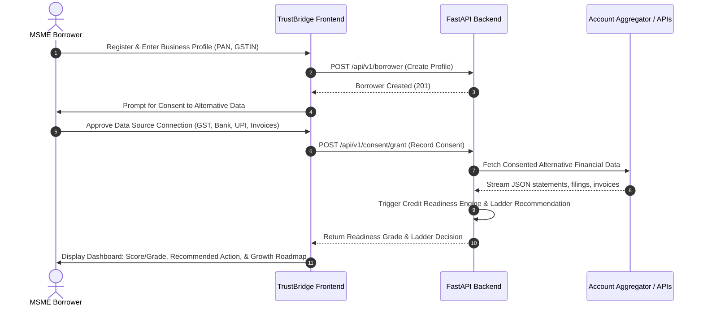
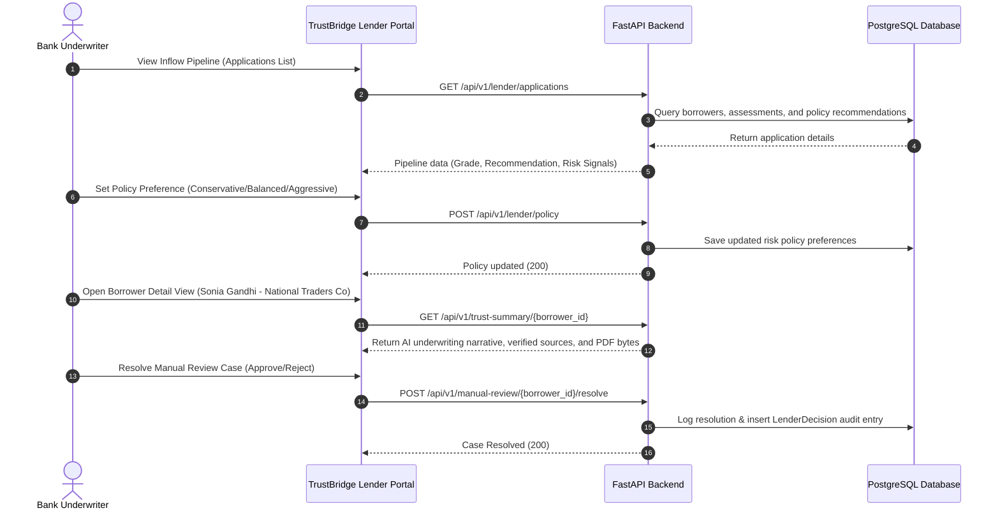

# TrustBridge AI: User Flows & Core System Journeys

This document details the step-by-step user journeys and system flows for **TrustBridge AI**, covering the borrower onboarding experience, lender underwriting activities, and the automated backend pipelines (Consent, Credit Readiness, Credit Ladder, and Manual Review).

---

## 1. Borrower Journey
The borrower is an MSME (Micro, Small, or Medium Enterprise) seeking digital credit. Rather than facing a black-box "approve/reject" decision, the borrower enters a dynamic "credit ladder" experience.



### Steps:
1.  **Identity & Profile Registration**: The borrower logs in and enters their legal name, business name, PAN, and GSTIN.
2.  **Consent Granting (Alternative Data Integration)**: The borrower is prompted to connect their operational accounts. They link their bank statement via the Account Aggregator (AA) framework, input tax portal credentials for GST, link their digital merchant UPI QR code, and connect their digital billing system (Invoices).
3.  **Real-Time Assessment**: Once connected, the engine fetches data, analyzes cashflows, and computes the credit readiness grade.
4.  **Dashboard Display**: The borrower sees their credit readiness grade (e.g., "A-"), a confidence band, data coverage percentage, and active credit ladder recommendations (e.g., "Starter Loan of ₹50,000 available").
5.  **Dynamic Credit Growth Roadmap**: If the borrower is not pre-qualified for the highest tier, they see a personalized, step-by-step checklist to improve their grade (e.g., "Connect your secondary UPI account to capture all cash inflows," or "File pending GST returns for May").

---

## 2. Lender Journey
The lender is a credit manager or underwriter from a partner financial institution (e.g., IDBI Bank) who oversees credit risk.



### Steps:
1.  **Pipeline Dashboard**: The lender views a dashboard of all active MSME applicants. The list displays the credit readiness grade, the credit ladder recommendations, and any active risk alerts (e.g., "Check Bounce Warning").
2.  **Risk Policy Configuration**: The lender can tune the underwriting appetite globally. Switching between "Conservative," "Balanced," and "Aggressive" alters how the Credit Ladder recommendations are computed in real-time.
3.  **Trust Summary Audit**: Clicking an applicant opens the detailed **Underwriting Trust Summary**. The lender reviews:
    *   An explainable **AI Underwriting Narrative** generated by Gemini, translating complex alternative transaction logs into clear business descriptions.
    *   A **Coverage Meter** showing connected vs. missing data streams.
    *   **Verified Data Sources** that verify the integrity of the audit logs.
    *   **Risk Signals** and **Reason Codes** explaining sub-scores.
4.  **PDF Export**: The underwriter can export the Trust Summary as an immutable PDF for audit committee filings.
5.  **Manual Review Resolution**: For applications flagged for manual review due to anomalies (e.g., three bounced checks in bank data), the lender reviews offline supplementary documents, enters notes, and resolves the case, automatically generating a permanent decision audit record.

---

## 3. Consent Flow
TrustBridge AI strictly enforces the **consent-by-design** principle. No financial data is parsed without active, time-bound consent.

```
[Borrower logs in]
       │
       ▼
[Active Consent Check] ──(Active Consent Exists?)──► [Extract Alternative Data]
       │                                                      │
       ▼ (No or Expired)                                      ▼
[Prompt Consent Request]                             [Access audit logging: record_consent_usage()]
       │                                                      │
       ▼                                                      ▼
[Borrower grants consent via AA]                     [Data sent to scoring engine]
       │
       ▼
[Log consent grant: record_consent_grant()]
```

### Protocol Steps:
1.  **Consent Check**: When a data extraction request is initiated, the system checks the `consents` table for active consent.
2.  **Redirect & Authorization**: If consent is missing, revoked, or expired, the user is redirected to the Account Aggregator or portal to sign the consent artifact.
3.  **Write Grant Audit**: The system saves the consent record with status `approved` and logs a "grant" entry in the `consent_audit_logs` table (timestamp, data source, scope, expiry, purpose).
4.  **Use Verification**: Every API call that retrieves third-party data must pass through the `record_consent_usage()` middleware. The middleware:
    *   Verifies that consent is active.
    *   Performs an **auto-expiry check** (`expiry < current_time`). If expired, it flags the consent as `expired` in the DB, blocks data access, writes an `expire` audit log, and returns `False`.
    *   Validates **purpose limitation** (checks that the request matches the agreed-upon financial purpose). If invalid, it logs a `use_denied` audit entry.
    *   Logs a `use` audit entry upon successful access.
5.  **Revocation**: The borrower can revoke access via their settings, changing the status to `revoked` in the DB and appending a `revoke` audit entry.

---

## 4. Credit Readiness Flow
This pipeline turns messy, alternative transactions into standardized credit readiness scores.

```
       [Raw Alternative Data Ingestion (GST, Bank, UPI, Invoices, Profile)]
                                     │
                                     ▼
                     [Standardize & Parse JSON Payloads]
                                     │
                                     ▼
               ┌─────────────────────┴─────────────────────┐
               ▼                                           ▼
      [Sub-Score Engine]                           [Risk Signals Engine]
  - Cash Flow (UPI frequency/trends)           - Scan GST gaps (<50% -> Critical)
  - Compliance (GST filed ratio)               - Check bounce counts (>=3 -> Critical)
  - Repayment (Debt/EMI burden ratio)          - Check high EMI burden (>50% -> Critical)
  - Growth (Revenue trend/Team delta)          - Identify early-stage business (<2 yrs)
               └─────────────────────┬─────────────────────┘
                                     ▼
                      [Compute Weighted Aggregate Score]
                        (Scale: 0-100; Grade: A+ to D)
                                     │
                                     ▼
                       [Determine Confidence Band]
                  - High: >=4 connected sources + >=8m history
                  - Medium: >=2 connected sources + >=4m history
                  - Low: otherwise
                                     │
                                     ▼
                     [Save Readiness Assessment & Details]
```

### Steps:
1.  **Ingestion & Standardisation**: Data payloads from GST summaries, bank statements, UPI files, and invoice histories are standardized.
2.  **Sub-Score Computation**:
    *   *Cash Flow (35%)*: Calculates inflow frequency, transaction velocity, monthly trends, and volatility penalties.
    *   *Compliance (20%)*: Evaluates GST filing compliance rates and EPFO employee trends.
    *   *Repayment (30%)*: Measures existing debt service capacity (EMI/inflow ratio) and bounced payments.
    *   *Growth (15%)*: Assesses annual turnover trajectories and organizational expansion.
3.  **Risk Signal & Reason Code Mapping**: Runs a rule-based engine to flag warnings (e.g., low volume, small team, low history) and critical risks (e.g., MULTIPLE_BOUNCES, HIGH_EMI_BURDEN).
4.  **Grade & Confidence Evaluation**: Maps the aggregate score to grades (A+ through D) and checks data density to set the Confidence Band (High, Medium, Low).

---

## 5. Credit Ladder Flow
Instead of a simple binary approve/reject decision, the Credit Ladder Engine recommends safe lending steps to transition MSMEs from informal credit into mainstream banking.

```
                  [Readiness Grade & Confidence Band Calculated]
                                        │
                                        ▼
                   [Read policy preference (Conservative/Balanced/Aggressive)]
                                        │
                                        ▼
                  [Match parameters against Policy Matrix]
                  e.g., Under Balanced Policy:
                    - Grade A  -> Pre-Qualified
                    - Grade B  -> Starter Loan
                    - Grade C  -> Manual Review
                    - Grade D  -> Improve First
                                        │
                                        ▼
                  [Run Override Checks (Critical Anomalies?)]
                    - Critical risk signal present?
                    - GST, Bank Statement, or AA disconnected?
                                 ├──► Yes ──► Force Outcome: "Manual Review"
                                 └──► No  ──► Maintain standard recommendation
                                        │
                                        ▼
                         [Return Recommended Action]
```

### Steps:
1.  **Fetch Risk Appetite**: The engine reads the lender's current policy setting (Conservative, Balanced, or Aggressive).
2.  **Apply Recommendation Rules**:
    *   *Conservative*: Restricts "Pre-Qualified" actions to Grade A; routes Grade B to "Starter Loan", Grade C to "Manual Review", and Grade D to "Improve First".
    *   *Aggressive*: Extends "Pre-Qualified" actions to both Grade A and B; routes Grade C to "Starter Loan", and Grade D to "Manual Review".
    *   *Balanced*: Standard default flow mapping.
3.  **Trigger Out-of-Bound Anomaly Overrides**: If the profile contains any critical risk signals (e.g., revenue declines of >10%, check bounce history) or lacks essential bank/GST connectivity, the engine overrides the recommendation and routes the application to **Manual Review**.

---

## 6. Manual Review Flow
The manual review flow handles anomalies or borderline cases that require human intervention.

```
       [Credit Ladder Engine returns "Manual Review" outcome]
                                 │
                                 ▼
         [Auto-create pending case in manual_reviews table]
                                 │
                                 ▼
           [Application listed on Lender's Review Queue]
                                 │
                                 ▼
           [Lender inspects profile & offline documents]
                                 │
                                 ▼
         [Lender submits resolution (approved / rejected / escalated)]
                                 │
                                 ▼
       ┌─────────────────────────┴─────────────────────────┐
       ▼                                                   ▼
[ManualReview status updated]                  [LenderDecision audit log recorded]
```

### Steps:
1.  **Auto-Routing**: When the Credit Ladder engine outputs a "Manual Review" decision, a record is automatically created in the `manual_reviews` table with status `pending`, copying the risk signals and reason codes.
2.  **Lender Queue Display**: The applicant is listed on the lender's Manual Review screen.
3.  **Auditor Assessment**: The underwriter opens the applicant's profile to inspect anomalies and verify any uploaded offline documents (e.g. physical tax receipts or trade license certificates).
4.  **Resolution Processing**: The underwriter resolves the case by selecting a status:
    *   `resolved` (maps to an approved decision): Approves the merchant for the starter loan tier.
    *   `rejected`: Refuses the loan request.
    *   `escalated`: Passes the case to a senior credit manager.
5.  **Audit Writing**: The system updates the `manual_reviews` record, timestamps `resolved_at`, logs the underwriter's notes, and writes a permanent `LenderDecision` record.
